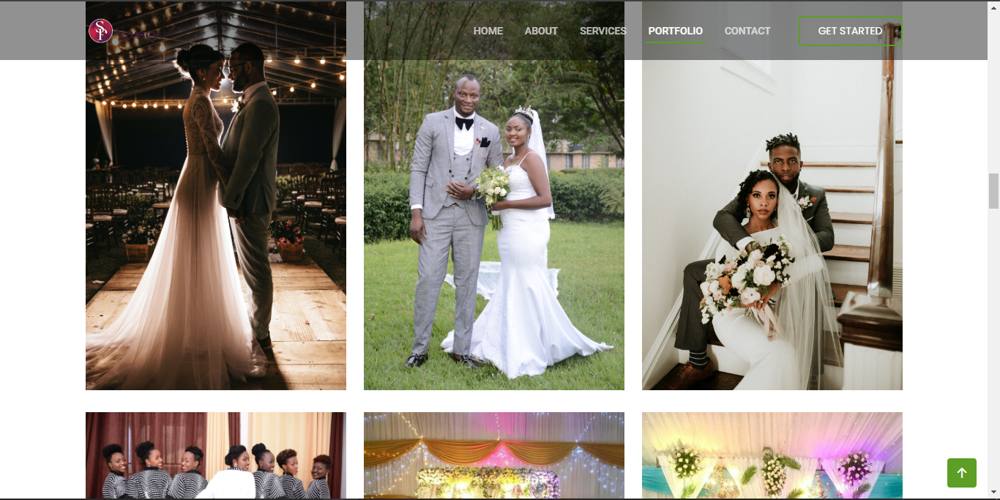

# SP Agency Website (Events Planner Group) 🎉



## Overview 📄
Welcome to the SP Agency Website repository! This project is designed to showcase the online presence of an events planning group, offering a sleek and modern interface to attract potential clients and provide detailed information about services, past events, and contact information.

## Features ✨
- **Responsive Design:** Optimized for all devices.
- **Modern UI:** A clean and professional look.
- **Event Showcase:** Highlight past and upcoming events.
- **Contact Form:** Easy communication for potential clients.
- **Gallery:** Visual showcase of events.

## Installation 🛠️
To get a local copy up and running, follow these steps:

1. **Clone the repository:**
    ```bash
    git clone https://github.com/yourusername/sp-agency-website.git
    ```

2. **Navigate to the project directory:**
    ```bash
    cd sp-agency-website
    ```

3. **Go Live:**


## Usage 🚀
Once the development server is running, open your browser and navigate to `http://localhost:5500` to view the website.


1. Fork the Project.
2. Create your Feature Branch (`git checkout -b feature/AmazingFeature`).
3. Commit your Changes (`git commit -m 'Add some AmazingFeature'`).
4. Push to the Branch (`git push origin feature/AmazingFeature`).
5. Open a Pull Request.

## License 📄
Distributed under the MIT License. See `LICENSE` for more information.

## Contact 📧
- **Your Name:** [tuyishimekyrie@gmail.com](mailto:tuyishimekyrie@gmail.com)
- **Project Link:** [https://github.com/tuyishimekyrie/sp-agency-website](https://github.com/tuyishimekyrie/sp-agency-website)
